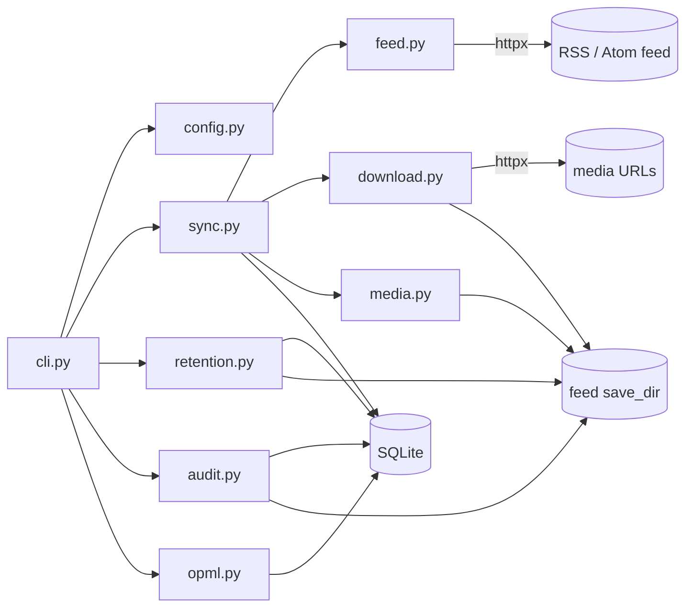

# Architecture

## Overview

`rss-downcast` is a local, single-user podcast archiver. It is a Typer CLI over a
small set of pure-Python modules, with a single SQLite file as the only state.
Each run of `sync` fetches a feed, downloads new episodes to a per-feed
directory, tags MP3s, and records rows so the next run is incremental. Retention
and inspection operate on the same database + filesystem pair. There is no
server, daemon, or background worker.

Design principles: modules are small and single-purpose; `cli.py` owns argument
parsing, config/flag precedence, and all rendering, while the other modules
return plain data or mutate DB/files; destructive filesystem operations are
always guarded by a `save_dir` containment check.

## Components

| Module | Responsibility |
|---|---|
| `__init__.py` | `__version__`, `USER_AGENT`, default config/db names. |
| `cli.py` | Typer app, global options, subcommands, TOML↔flag precedence, output. |
| `config.py` | Locate + load TOML (`[defaults]` table or top-level keys), `KNOWN_KEYS` whitelist. |
| `db.py` | SQLite schema, connection/context manager, feed + episode CRUD, `list_episodes`. |
| `feed.py` | Fetch (httpx), parse (feedparser), naive-UTC date normalization, candidate selection, audio-enclosure detection. |
| `download.py` | Streaming download with retry/backoff, partial-file cleanup, Content-Length verification. |
| `media.py` | Filename sanitizing, collision-safe paths, ID3 tagging, `.txt` sidecars. |
| `retention.py` | Parse `--max-age`/`--max-size`, `prune_feed` (keep / age / size), path-contained deletion. |
| `opml.py` | OPML export/import. |
| `sync.py` | Orchestration: `collect_episodes` → `run_sync` (select → download → tag → DB) → `sync_url` (fetch → ensure feed → `run_sync`). |
| `audit.py` | Read-only inspection: per-feed summaries, episode listing, missing-file and orphan-file detection. |

## Data flow



`sync` is the only writer of episode rows and downloaded files. `prune` and
`verify --fix`/`--remove-orphans` are the only deleters, and all three constrain
deletion to the feed's `save_dir` via `os.path.commonpath`.

## Data model

```sql
feeds (
  feed_id    INTEGER PRIMARY KEY AUTOINCREMENT,
  feed_url   TEXT UNIQUE NOT NULL,
  feed_title TEXT,
  save_dir   TEXT,                 -- absolute path, set/updated by sync or `feeds add`
  created_at TEXT NOT NULL DEFAULT ''
)

episodes (
  episode_id    INTEGER PRIMARY KEY AUTOINCREMENT,
  feed_id       INTEGER NOT NULL REFERENCES feeds(feed_id) ON DELETE CASCADE,
  guid          TEXT NOT NULL,
  title         TEXT,
  published     TEXT,              -- naive-UTC ISO string, '' when unknown
  filepath      TEXT,
  downloaded_at TEXT,
  UNIQUE (feed_id, guid)
)
```

Key invariants:

- `UNIQUE(feed_id, guid)` is the dedup guard; a duplicate INSERT is treated as
  "already downloaded" and the freshly downloaded file is removed.
- `published` is always naive UTC (`feed._naive_utc`), so `MAX(published)` string
  ordering equals chronological ordering and incremental sync never mixes
  aware/naive datetimes.
- `PRAGMA foreign_keys = ON` is set on every connection; deleting a feed cascades
  to its episodes.

## Error handling & exit codes

- `feed.fetch_feed` logs and raises `SystemExit(1)` on network failure.
- `sync --all-feeds` catches that per feed, logs it, continues, and exits `1` if
  any feed failed; a single explicit `sync` propagates it.
- `verify` exits `1` while findings remain unfixed and `0` once clean or fully
  repaired.
- Invalid flags/arguments raise `typer.BadParameter` (Typer exits `2`).

## Key decisions

| Decision | Choice | Rationale |
|---|---|---|
| CLI framework | Typer | Typed subcommands, generated help, minimal boilerplate. |
| HTTP client | httpx | Streaming + timeouts; `requests`-style sessions are only an optional test shim. |
| State store | SQLite file | Zero-config, single-user; uniqueness + cascade in the DB itself. |
| v2 schema | No v1 migration | Deliberate break; v1 databases are not read. |
| Dates | Naive UTC everywhere | Prevents aware/naive comparison crashes across feeds. |
| Feed parsing | feedparser | Mature RSS/Atom handling. |
| Tagging | mutagen | Reliable ID3v2 writes. |
| Config precedence | CLI > TOML > default | Flag provenance read from `Context.get_parameter_source`, so a flag overrides the conflicting config key. |
| Orphan files | Detect in `verify`, delete only with `--remove-orphans` | File deletion is never implicit. |
| Save dirs | Flat, one per feed | Keeps orphan scanning and containment checks simple. |
| Inspection | Separate read-only `audit` module | Keeps `db.py` pure persistence; CLI stays a formatter. |

## Directory layout

```
src/rss_downcast/
├── __init__.py      # version, USER_AGENT, default names
├── cli.py           # Typer app: sync, status, verify, prune, feeds, episodes, opml
├── config.py        # TOML loading + discovery
├── db.py            # schema, connections, CRUD
├── feed.py          # fetch/parse/dates/selection
├── download.py      # streaming download + retry
├── media.py         # filenames, ID3 tags, sidecars
├── retention.py     # size/age parsing + prune_feed
├── opml.py          # OPML import/export
├── sync.py          # run_sync / sync_url orchestration
└── audit.py         # status / episodes / verify data layer
tests/
├── conftest.py      # `mod` compatibility facade for the v1 test suite
├── unit/            # fast, isolated (db temp files, CliRunner)
└── integration/     # local HTTP fixture server, real httpx download path
docs/specs/          # feature specs (north star per feature)
```

## Testing strategy

- `tests/unit` — module and CLI tests with temporary databases and `CliRunner`.
  New tests import `rss_downcast.*` directly.
- `tests/integration` — a local `ThreadingHTTPServer` fixture serves a feed and
  media; tests exercise the real `sync` command over httpx, plus batch flags.
- `tests/conftest.py` exposes a `mod` namespace with v1-era attribute names so
  the migrated legacy suite keeps running; it is a bridge, not the public API.
- Run `pytest tests/unit -q`, `pytest tests/integration -q`, `ruff check .`.

## Decisions log

The table above summarises standing decisions. New significant or hard-to-reverse
decisions should be added as lightweight ADRs under `docs/adr/`.
