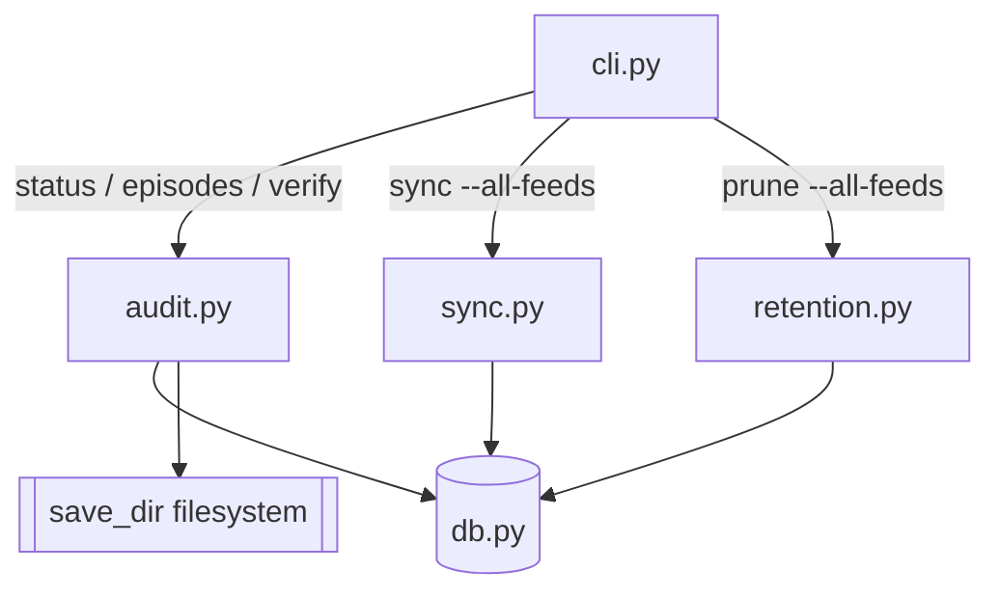

# Feature: CLI inspection & batch tooling — `status`, `episodes`, `verify`, `--all-feeds`

## Problem Statement

A real maintenance run ("keep the latest 2 episodes of every feed, then pull
updates") could not be done with the CLI alone:

- `feeds list` exposes only feed rows. There is no way to see an episode's
  publication date, size, path, or whether its file still exists — that required
  querying SQLite by hand.
- There is no integrity view. The live database contained **12 episode rows
  whose files had been deleted out-of-band** (Dante Gebel, #11–20/#31–32), plus
  the orphan-file class the v2.0.1 fix now prevents but cannot retroactively
  detect. Neither is visible from the CLI.
- `sync` and `prune` act on one feed, so the batch step required a hand-written
  `for id in 1 2 3 4` shell loop with `--feed-id`.

## Background

The v2.0.1 fix stops a duplicate GUID from *creating* an orphan file, but
nothing surfaces pre-existing orphans or missing files, and nothing inspects a
library at row granularity. The chosen design keeps `db.py` as pure
persistence: a new read-only `audit.py` combines DB rows with a filesystem scan
and returns plain data; the CLI stays a thin formatter. Batch flags reuse the
existing single-feed code paths rather than new logic.

Two constraints drive the design:
- **Flat save dirs.** Feeds download into a single directory (no nesting), so
  orphan detection scans `save_dir` non-recursively and only considers
  audio/video extensions — `.txt` sidecars from `--save-text` are deliberately
  ignored so they are never reported as orphans.
- **Per-feed isolation in batches.** `feed.fetch_feed()` raises `SystemExit(1)`
  on network failure. A batch must catch that per feed, log and continue, and
  exit non-zero at the end if any feed failed, instead of aborting the loop.

## Requirements

- [x] REQ-1: `rss-downcast status [--feed-id ID] [--json]` prints one row per
  feed — id, title, save_dir, episode rows, audio files on disk, total on-disk
  size, newest `published`, missing-file count, orphan count — plus a totals
  line. Exits 0 even when problems are found.
- [x] REQ-2: `rss-downcast episodes list [--feed-id ID] [--limit N] [--missing]
  [--json]` lists episode rows newest-first with published timestamp, size,
  existence flag and path. `--missing` restricts to rows whose file is absent.
  Default limit is 50; `--limit 0` means no limit, negative values are
  rejected.
- [x] REQ-3: `rss-downcast verify [--feed-id ID] [--fix] [--remove-orphans]
  [--json]` reports, per feed, rows with missing files and orphan audio files.
  `--fix` deletes missing-file rows; `--remove-orphans` deletes orphan files.
  Both are independent; `--fix` alone never touches files. Exit 0 when clean,
  non-zero when findings remain unfixed.
- [x] REQ-4: `sync --all-feeds` and `prune --all-feeds` iterate every feed using
  its stored `save_dir`. A failure for one feed is logged, the loop continues,
  and the process exits non-zero if any feed failed. `--all-feeds` is mutually
  exclusive with `URL`/`--feed-id`.
- [x] REQ-5: Orphan detection considers only audio/video extensions
  (`.mp3 .m4a .mp4 .ogg .opus .flac .wav .aac`, case-insensitive), compares
  absolute paths, and scans `save_dir` non-recursively.
- [x] REQ-6: No schema change. Commands are read-only except when `--fix` or
  `--remove-orphans` is passed.
- [x] REQ-7: New tests exercise the real API and the CLI (`CliRunner`) against a
  temp DB + temp save dir; `ruff check` and `ruff format --check` stay clean and
  the full suite passes.

### Scenarios

```gherkin
Feature: status

  Scenario: healthy feed
    Given a feed with 2 rows and 2 files on disk
    When the user runs status
    Then the feed row reports 2 episodes, 0 missing and 0 orphans

  Scenario: missing file is surfaced
    Given a feed with 2 rows but one file deleted from disk
    When the user runs status
    Then the feed row reports missing = 1
    And the command still exits 0

Feature: verify and repair

  Scenario: verify reports without changing anything
    Given a feed with one missing file and one orphan file
    When the user runs verify
    Then both are listed
    And the row and the orphan file still exist

  Scenario: fix removes dead rows only
    Given a feed with one missing-file row and one orphan file
    When the user runs verify --fix
    Then the missing-file row is deleted
    And the orphan file is left on disk

  Scenario: remove-orphans deletes untracked files only
    Given a feed with one missing-file row and one orphan file
    When the user runs verify --remove-orphans
    Then the orphan file is deleted
    And the missing-file row remains

Feature: batch operations

  Scenario: sync every feed
    Given two feeds with locally served feeds, one reachable and one that 404s
    When the user runs sync --all-feeds
    Then the reachable feed is downloaded
    And the unreachable feed is reported as failed
    And the command exits non-zero

  Scenario: prune every feed
    Given two feeds each with 3 episodes on disk
    When the user runs prune --all-feeds --keep 2
    Then each feed keeps its 2 newest episodes
```

## Architecture



`audit.py` returns plain tuples/dicts; `cli.py` owns all rendering and exit
codes. `verify --fix` deletes rows via `db` (existing `DELETE`), and
`--remove-orphans` deletes files with the same `os.path.commonpath(save_dir, …)`
containment guard already used by `prune_feed` and `remove_feed`.

## API / Interface

- `audit.AUDIO_EXTS: frozenset[str]` — extension set from REQ-5.
- `audit.feed_summary(conn, feed_id) -> FeedSummary` — dataclass:
  `feed_id, title, save_dir, episodes, files, size_bytes, newest, missing, orphans`.
- `audit.summaries(conn, feed_id=None) -> list[FeedSummary]`.
- `audit.list_episodes(conn, feed_id=None, limit=50, missing_only=False)
  -> list[EpisodeInfo]` — `feed_id, published, size, exists, filepath`.
- `audit.find_missing(conn, feed_id=None) -> list[Row]` and
  `audit.find_orphans(feed_id, save_dir) -> list[str]` (absolute paths).
- `db.list_episodes(conn, feed_id=None) -> list[sqlite3.Row]` (raw rows, ordered
  `published DESC, episode_id DESC`).
- CLI: new `episodes_app = typer.Typer(...)` registered on `app`; new top-level
  `status` and `verify` commands; `--all-feeds` flags on `sync` and `prune`.

## Testing Strategy

- `tests/unit/test_audit.py` — summaries, missing detection, orphan detection
  (`.txt` sidecar ignored, wrong extension ignored), `--limit`/`--missing`
  filtering on a temp DB + temp dir.
- `tests/unit/test_cli_inspect.py` — `CliRunner` for `status`, `episodes list`,
  `verify` (report / `--fix` / `--remove-orphans`) asserting both output and
  post-state.
- `tests/integration/test_cli_batch.py` — reuse the local HTTP fixture for
  `sync --all-feeds` (one good URL, one 404 feed) and `prune --all-feeds`.
- Full suite + `ruff check` + `ruff format --check`.

## Out of Scope

- `--json` output (deferred to a follow-up; the data layer already returns
  dataclasses so adding it later is mechanical) and JSON for `feeds list`.
- Recursive orphan scanning, symlink traversal, or non-media artifact cleanup.
- A `db backup`/restore command; `--fix` is documented to run after a manual DB
  copy.
- Scheduling/watch mode or desktop notifications.
- Generating `ARCHITECTURE.md` (tracked separately).
