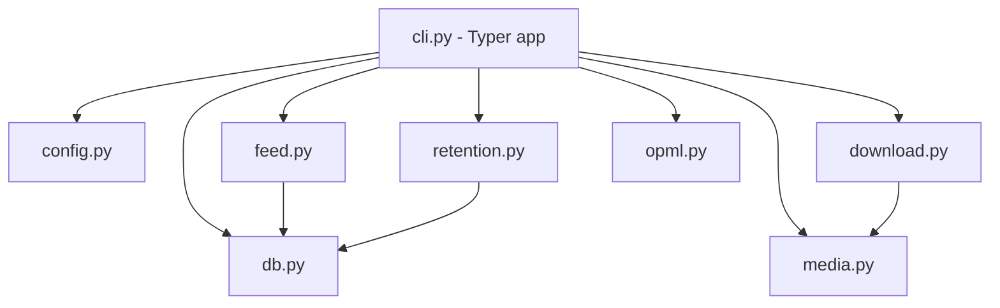

# Feature: v2 rss-downcast — Typer + src layout + rebrand

## Problem Statement

`rss-podcast-downloader.py` (1467 líneas, 35 funciones, single-file) mezcla CLI,
config, DB, RSS, download, tagging, retention y OPML en un archivo. El shim
`rss_podcast_downloader.py` (importlib dinámico del archivo con guiones) existe
solo para empaquetar. `main()` (~280 líneas) hace pre-parseo manual de
`sys.argv` para config. `parse_and_download()` (~190 líneas) mezcla selección,
dry-run, download loop, DB, tagging y sleep. Difícil de mantener y testear.

Además: branding del fork original (`johnsosoka`), `pyproject.toml` dice MIT
pero `LICENSE` es GPLv3, y `requirements.txt` pinnea dependencias transitivas.

## Background

El usuario decidió alejarse del upstream y reescribir como proyecto propio:
todo se conserva funcionalmente, se rompe compatibilidad de CLI/DB si simplifica,
stack Typer, autor Audel Diaz, licencia GPLv3, nombre `rss-downcast`
(verificado libre en PyPI/GitHub; `podsync`, `podgrab`, `feedcast` ocupados).

## Requirements

- [ ] REQ-1: Paquete `src/rss_downcast/` importa sin shim; se elimina
  `rss-podcast-downloader.py` + `rss_podcast_downloader.py` legacy al final.
- [ ] REQ-2: CLI Typer con subcomandos `sync`, `feeds list|add|remove`,
  `prune`, `opml export|import`. Opciones globales `--verbose/--quiet`,
  `--config/--no-config`, `--db`. Sin pre-parseo manual de `sys.argv`.
- [ ] REQ-3: Paridad funcional v1.1.0: incremental sync, `--num/--since/--all`,
  first-run guard, `--dry-run`, `--save-text`, MP3 tags, `--keep/--keep-last/
  --max-age/--max-size`, OPML, TOML `[defaults]`, `audio/*`+`video/mp4`,
  anti-colisión `_<n>`, retry download, per-feed save-dir.
- [ ] REQ-4: Rebrand total: `pyproject` name `rss-downcast`, autor Audel Diaz,
  URLs `github.com/AudelDiaz/rss-downcast`, entry point `rss-downcast`,
  `USER_AGENT`, docstrings, README, `config.example.toml`
  (`rss-downcast.toml`). Una línea de atribución al fork en CHANGELOG (GPL §5).
- [ ] REQ-5: Deps mínimas directas: `typer`, `feedparser`, `httpx`, `mutagen`.
  Transitivas (`certifi`, `charset-normalizer`, `idna`, `urllib3`, `sgmllib3k`)
  fuera de `requirements.txt`. `requires-python >=3.11` (tomllib stdlib).
- [ ] REQ-6: Tests migran a `from rss_downcast.* import ...`; `pytest`
  unit+integration en verde; `ruff check` limpio.
- [ ] REQ-7: `pip-audit` sin vulnerabilidades conocidas en deps directas.

### Scenarios

```gherkin
Feature: sync seeds guard
  Scenario: feed nuevo sin flags de seed no descarga nada
    Given un feed sin filas en episodes
    When sync sin --num/--since/--all
    Then 0 descargas y mensaje de seed requerido

Feature: incremental sync
  Scenario: solo episodios nuevos tras última descarga
    Given feed con fecha max descargada D
    When sync
    Then solo episodios con fecha > D son candidatos

Feature: prune keep
  Scenario: --keep 5 deja 5 más nuevos
    Given 8 episodios en disco+DB
    When prune --keep 5
    Then 5 archivos + 5 filas, los más nuevos
```

## Architecture



Módulos:

- `config.py` — `find_config_path()`, `load_config()` (tomllib stdlib,
  tabla `[defaults]` o top-level). Sin fallback `tomli`.
- `db.py` — `get_conn(db_path)` context manager, `init_schema()`,
  CRUD feeds/episodes, `get_last_downloaded()`, `has_episodes()`.
  `row_factory=sqlite3.Row` (index + key access). FK `ON DELETE CASCADE`.
  DB default: `~/.local/share/rss-downcast/downloads.db` (nuevo path v2;
  se rompe compat con `./downloads.db`). Sin migración legacy v1.
- `feed.py` — `fetch_feed(url)` (httpx, UA rebranded), `select_candidates()`,
  `_entry_datetime()`, sort key.
- `download.py` — `download_file()` streaming + retry (httpx).
- `media.py` — sanitize, `filename_from_entry()`, `unique_filepath()`,
  `set_mp3_tags()`, `save_text_file()`, `entry_date_prefix()`.
- `retention.py` — `parse_size()`, `parse_max_age()`, `prune_feed()`.
- `opml.py` — export/import.
- `sync.py` — orquestación `run_sync()` (select → download → tag → DB) y
  `sync_url()` (fetch → ensure feed → run_sync, retorna
  `(considered, downloaded, feed_id)`). La CLI usa `sync_url` + `prune_feed`
  dentro de `db.get_conn()`; sin conexiones sueltas.
- `cli.py` — Typer app + subcomandos. `__init__.py` expone `__version__=2.0.0`.

CLI:

```bash
rss-downcast sync URL DIR [--num N --since DATE --all --dry-run --save-text]
rss-downcast feeds list | add URL [DIR] | remove ID [--delete-files]
rss-downcast prune DIR [--keep N --keep-last --max-age 30d --max-size 2G]
rss-downcast opml export FILE | import FILE
rss-downcast [--version] [--verbose/--quiet --config FILE --no-config --db FILE]
```

## API / Interface

- `db.get_conn(path)` context manager (`row_factory=Row`, foreign_keys ON).
- `feed.select_candidates(all_eps, last, num, since) -> list`
- `download.download_file(url, path, session=None, client=None) -> bool`
  (dual transporte httpx/requests-style; salta length-check con
  Content-Encoding; OSError local no reintenta).
- `retention.prune_feed(conn, feed_id, save_dir, keep, max_age, max_size,
  dry_run) -> (kept, removed)`; `prune_to_keep_last` retorna lo mismo.
- Schema v2: `feeds(feed_id, feed_url UNIQUE, feed_title, save_dir,
  created_at)`, `episodes(episode_id, feed_id FK CASCADE, guid, title,
  published, filepath, downloaded_at, UNIQUE(feed_id, guid))`.
- Fechas siempre naive-UTC (`_naive_utc`); `select_candidates` nunca mezcla
  aware/naive.

## Testing Strategy

- Unit existentes re-apuntados a `rss_downcast.*` (sanitize, config, retention
  parsing, db/selection, OPML, save-dir, sync-ux, hardening).
- Integración: servidor HTTP local + DB temporal, comando `sync` end-to-end.
- `uv run pytest tests/unit -v`, `uv run pytest tests/integration -v`,
  `uv run ruff check .`, `pip-audit` sobre directas.

## Out of Scope

- Cambio de `feedparser` (riesgo conocido: sin releases desde 2023; evaluar
  `atoma` en v2.1).
- Migración automática de `downloads.db` v1 → v2 (ruptura aceptada).
- Publicación a PyPI / Docker (solo bump a 2.0.0 local).
- Negar un bool `true` del TOML desde CLI en una invocación (`false` es el
  default y no se distingue de "no pasado" en Typer 0.27 sin API de
  parameter-source).
- Prune/retención cross-feed con `save_dir` compartido (guards son por feed);
  `sync` a un directorio distinto re-apunta el `save_dir` canónico del feed.
- Límite exacto de `--max-age` en el cutoff (`<`, no `<=`); `utcnow` vs zona
  local (heredado v1).
