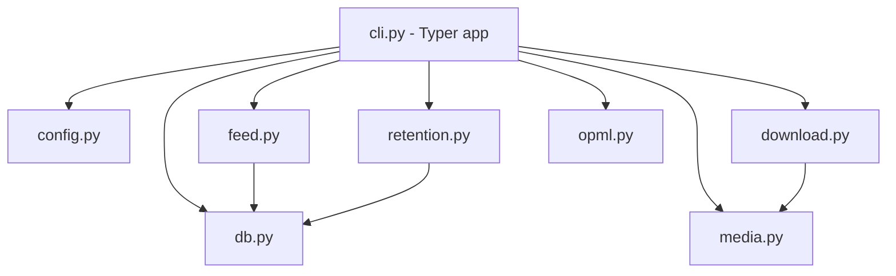

# Feature: v2 rss-downcast — Typer + src layout + rebrand

## Problem Statement

`rss-podcast-downloader.py` (1467 lines, 35 functions, single file) mixed CLI,
config, DB, RSS, download, tagging, retention and OPML in one file. The
`rss_podcast_downloader.py` shim (dynamic importlib of the hyphenated file)
existed only for packaging. `main()` (~280 lines) hand-parsed `sys.argv` for
config. `parse_and_download()` (~190 lines) mixed selection, dry-run, download
loop, DB, tagging and sleep. Hard to maintain and test.

Also: branding from the original fork (`johnsosoka`), `pyproject.toml` said MIT
while `LICENSE` is GPLv3, and `requirements.txt` pinned transitive dependencies.

## Background

The user decided to move away from upstream and rewrite this as an independent
project: everything is preserved functionally, CLI/DB compatibility may break if
it simplifies things, Typer stack, author Audel Diaz, GPLv3 license, name
`rss-downcast` (verified free on PyPI/GitHub; `podsync`, `podgrab`, `feedcast`
taken).

## Requirements

- [ ] REQ-1: The `src/rss_downcast/` package imports without a shim; the legacy
  `rss-podcast-downloader.py` + `rss_podcast_downloader.py` are deleted at the end.
- [ ] REQ-2: Typer CLI with subcommands `sync`, `feeds list|add|remove`,
  `prune`, `opml export|import`. Global options `--verbose/--quiet`,
  `--config/--no-config`, `--db`. No manual `sys.argv` pre-parsing.
- [ ] REQ-3: Functional parity with v1.1.0: incremental sync, `--num/--since/--all`,
  first-run guard, `--dry-run`, `--save-text`, MP3 tags, `--keep/--keep-last/
  --max-age/--max-size`, OPML, TOML `[defaults]`, `audio/*`+`video/mp4`,
  anti-collision `_<n>`, download retry, per-feed save-dir.
- [ ] REQ-4: Full rebrand: `pyproject` name `rss-downcast`, author Audel Diaz,
  URLs `github.com/AudelDiaz/rss-downcast`, entry point `rss-downcast`,
  `USER_AGENT`, docstrings, README, `config.example.toml`
  (`rss-downcast.toml`). One line of fork attribution in the CHANGELOG (GPL §5).
- [ ] REQ-5: Minimal direct deps: `typer`, `feedparser`, `httpx`, `mutagen`.
  Transitive deps (`certifi`, `charset-normalizer`, `idna`, `urllib3`, `sgmllib3k`)
  kept out of `requirements.txt`. `requires-python >=3.11` (tomllib stdlib).
- [ ] REQ-6: Tests migrate to `from rss_downcast.* import ...`; `pytest`
  unit+integration green; `ruff check` clean.
- [ ] REQ-7: `pip-audit` with no known vulnerabilities in direct deps.

### Scenarios

```gherkin
Feature: sync seed guard
  Scenario: new feed without seed flags downloads nothing
    Given a feed with no rows in episodes
    When sync without --num/--since/--all
    Then 0 downloads and a seed-required message

Feature: incremental sync
  Scenario: only new episodes after the last download
    Given a feed with max downloaded date D
    When sync
    Then only episodes with date > D are candidates

Feature: prune keep
  Scenario: --keep 5 leaves the 5 newest
    Given 8 episodes on disk + DB
    When prune --keep 5
    Then 5 files + 5 rows, the newest ones
```

## Architecture


```mermaid
graph TD
  CLI[cli.py - Typer app] --> CFG[config.py]
  CLI --> DB[db.py]
  CLI --> FEED[feed.py]
  CLI --> DL[download.py]
  CLI --> MEDIA[media.py]
  CLI --> RET[retention.py]
  CLI --> OPML[opml.py]
  FEED --> DB
  DL --> MEDIA
  RET --> DB
```

Modules:

- `config.py` — `find_config_path()`, `load_config()` (stdlib tomllib,
  `[defaults]` table or top-level). No `tomli` fallback.
- `db.py` — `get_conn(db_path)` context manager, `init_schema()`,
  feeds/episodes CRUD, `get_last_downloaded()`, `has_episodes()`.
  `row_factory=sqlite3.Row` (index + key access). FK `ON DELETE CASCADE`.
  Default DB: `~/.local/share/rss-downcast/downloads.db` (new v2 path;
  breaks compatibility with `./downloads.db`). No v1 legacy migration.
- `feed.py` — `fetch_feed(url)` (httpx, rebranded UA), `select_candidates()`,
  `_entry_datetime()`, sort key.
- `download.py` — `download_file()` streaming + retry (httpx).
- `media.py` — sanitize, `filename_from_entry()`, `unique_filepath()`,
  `set_mp3_tags()`, `save_text_file()`, `entry_date_prefix()`.
- `retention.py` — `parse_size()`, `parse_max_age()`, `prune_feed()`.
- `opml.py` — export/import.
- `sync.py` — orchestration `run_sync()` (select → download → tag → DB) and
  `sync_url()` (fetch → ensure feed → run_sync, returns
  `(considered, downloaded, feed_id)`). The CLI uses `sync_url` + `prune_feed`
  inside `db.get_conn()`; no loose connections.
- `cli.py` — Typer app + subcommands. `__init__.py` exposes `__version__=2.0.0`.

CLI:

```bash
rss-downcast sync URL DIR [--num N --since DATE --all --dry-run --save-text]
rss-downcast sync --feed-id ID [DIR]  # reuses stored URL/save-dir
rss-downcast feeds list | add URL [DIR] | remove ID [--delete-files]
rss-downcast prune DIR [--keep N --keep-last --max-age 30d --max-size 2G]
rss-downcast opml export FILE | import FILE
rss-downcast [--version] [--verbose/--quiet --config FILE --no-config --db FILE]
```

## API / Interface

- `db.get_conn(path)` context manager (`row_factory=Row`, foreign_keys ON).
- `feed.select_candidates(all_eps, last, num, since) -> list`
- `download.download_file(url, path, session=None, client=None) -> bool`
  (dual httpx/requests-style transport; skips length-check with
  Content-Encoding; local OSError is not retried).
- `retention.prune_feed(conn, feed_id, save_dir, keep, max_age, max_size,
  dry_run) -> (kept, removed)`; `prune_to_keep_last` returns the same.
- v2 schema: `feeds(feed_id, feed_url UNIQUE, feed_title, save_dir,
  created_at)`, `episodes(episode_id, feed_id FK CASCADE, guid, title,
  published, filepath, downloaded_at, UNIQUE(feed_id, guid))`.
- Dates are always naive UTC (`_naive_utc`); `select_candidates` never mixes
  aware/naive.

## Testing Strategy

- Existing unit tests repointed to `rss_downcast.*` (sanitize, config, retention
  parsing, db/selection, OPML, save-dir, sync-ux, hardening).
- Integration: local HTTP server + temporary DB, `sync` command end-to-end.
- `uv run pytest tests/unit -v`, `uv run pytest tests/integration -v`,
  `uv run ruff check .`, `pip-audit` on direct deps.

## Out of Scope

- Switching `feedparser` (known risk: no releases since 2023; evaluate
  `atoma` in v2.1).
- Automatic v1 → v2 `downloads.db` migration (breaking change accepted).
- PyPI / Docker publishing (local 2.0.0 bump only).
- Denying a TOML `true` boolean from the CLI in a single invocation (`false` is
  the default and is indistinguishable from "not passed" in Typer 0.27 without
  a parameter-source API).
- Cross-feed prune/retention with a shared `save_dir` (guards are per feed);
  `sync` to a different directory repoints the feed's canonical `save_dir`.
- Exact `--max-age` cutoff boundary (`<`, not `<=`); `utcnow` vs local timezone
  (inherited from v1).
