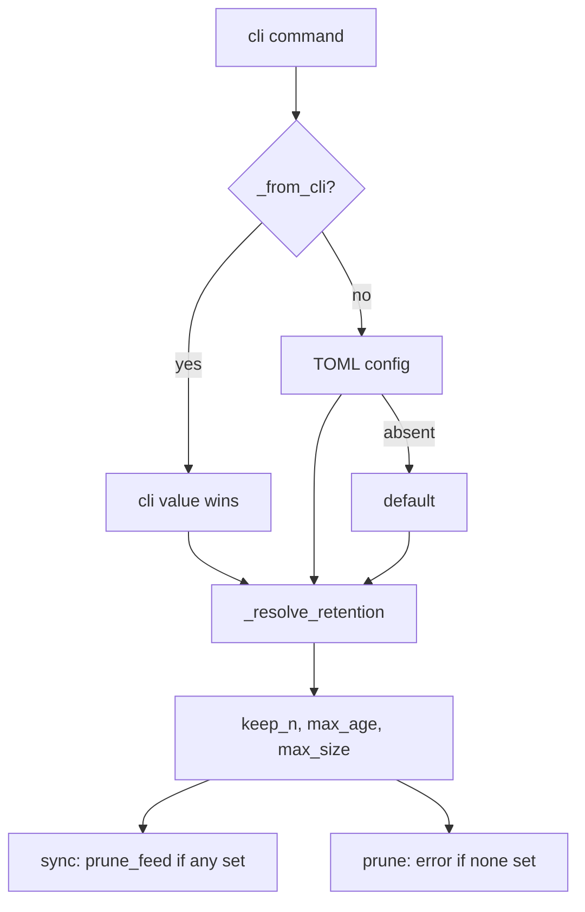

# Feature: v2.0.1 review fixes — flag precedence, orphan cleanup, CLI e2e

## Problem Statement

An adversarial review of the v2.0.0 tree surfaced five actionable defects that a
green test-suite did not catch:

1. TOML `keep` makes `--keep-last` unusable: `cli._eff()` merges config into the
   values *before* the `--keep` / `--keep-last` mutual-exclusion check, so the
   presence of `keep = 5` in `config.example.toml` turns every
   `prune DIR --keep-last` (and `sync --keep-last`) into
   `Invalid value: --keep and --keep-last are mutually exclusive`.
2. A duplicate GUID aborts the episode INSERT *after* the file was written,
   leaving an orphaned file on disk with no DB row (reproduced: one entry with
   two audio enclosures produces `..._2.mp3` with no row).
3. `--max-size` is validated as `>= 1` in `sync` but not in `prune`; the two
   commands duplicate ~30 lines of identical retention validation and have
   already drifted.
4. `retention.prune_feed()` uses `datetime.utcnow()`, deprecated on the 3.12+
   line (warns under 3.14) and scheduled for removal.
5. The integration suite never invokes the real CLI or `sync.sync_url()`; it
   drives the `conftest.mod` compatibility facade, so `cli.py` sits at 63% and
   `sync_url()` at 0%. This is why defect 1 shipped.

## Background

The CLI resolves effective option values as "CLI wins, else TOML, else default".
The bug is not the precedence intent but *when* it is applied: mutual exclusion
must be evaluated on what the user actually typed, not on the merged result.
Typer 0.27 exposes the required provenance via
`typer.Context.get_parameter_source(name)` (`COMMANDLINE` vs `DEFAULT`), so the
earlier assumption in `_eff()`'s docstring that "Typer 0.27 has no
parameter-source API" is no longer true.

The orphan-file defect is a direct consequence of ordering: files are written
before the row is persisted, and the failure path does not roll the file back.
`media.unique_filepath()` guarantees the target path did not exist before the
download, so deleting it on failure is always safe.

The test defect is structural: the `mod` facade was a deliberate v1→v2 bridge,
but it means the shipped entry points are not exercised. New tests target the
real `rss_downcast.*` API and `typer.testing.CliRunner` directly.

## Requirements

- [x] REQ-1: A CLI flag beats the config value for the same option. `--keep-last`
  works when TOML sets `keep`, and vice versa; the mutual-exclusion error fires
  only when both flags are passed on the command line.
- [x] REQ-2: A config file that sets both `keep` and `keep_last`, with neither
  flag on the CLI, is a clear `BadParameter` (not a silent pick).
- [x] REQ-3: When an episode INSERT fails after a successful download, the
  partial/orphaned file is removed before continuing.
- [x] REQ-4: `--keep`, `--max-age` and `--max-size` are parsed and validated by
  one shared helper used by both `sync` and `prune`; `--max-size` must be
  `>= 1` byte everywhere.
- [x] REQ-5: `retention.prune_feed()` uses a timezone-aware UTC "now",
  normalized to naive UTC for comparison with stored `published` values.
- [x] REQ-6: Integration tests drive the real `sync` command through
  `cli.app` + `CliRunner` (fetch → download → prune) against the local HTTP
  fixture.
- [x] REQ-7: Unit tests cover the config-vs-flag matrix and the orphan path;
  `ruff check` / `ruff format --check` stay clean and all tests pass.

### Scenarios

```gherkin
Feature: retention flag precedence

  Scenario: config keep does not block --keep-last
    Given a config file with [defaults] keep = 5
    When the user runs prune DIR --keep-last
    Then the command succeeds and keeps only the newest episode

  Scenario: CLI keep overrides config keep_last
    Given a config file with [defaults] keep_last = true
    When the user runs prune DIR --keep 3
    Then the command succeeds and keeps the 3 newest episodes

  Scenario: both flags on the command line conflict
    When the user runs prune DIR --keep 3 --keep-last
    Then the command fails with a mutual-exclusion error

  Scenario: config sets both keys
    Given a config file with [defaults] keep = 5 and keep_last = true
    When the user runs prune DIR
    Then the command fails with a clear config-conflict error

Feature: duplicate GUID cleanup

  Scenario: entry exposes two audio enclosures
    Given a feed entry whose GUID is already recorded for this feed
    When sync processes the duplicate link
    Then no new episode row is created
    And no orphaned file remains in the save directory

Feature: CLI sync end to end

  Scenario: first CLI run seeds and downloads
    Given a fresh database and a local feed with two episodes
    When the user runs sync URL DIR --all
    Then both episode files exist and two rows are recorded

  Scenario: prune runs in the same invocation as sync
    Given the episodes were downloaded by sync
    When the user runs sync URL DIR --all --keep-last
    Then only the newest episode file and row remain
```

## Architecture

Resolution order for each retained option, evaluated independently:

| Provenance | `--keep` + `--keep-last` | Outcome |
|---|---|---|
| both on CLI | yes | `BadParameter` (mutually exclusive) |
| only `--keep` | no | `keep` used, config `keep_last` ignored |
| only `--keep-last` | no | `keep_last` used, config `keep` ignored |
| neither | no | config values used; if config sets both → `BadParameter` |



`sync.run_sync()` keeps its existing shape; the only change is that the
duplicate-GUID failure path unlinks the freshly written file before `continue`.

## API / Interface

- `cli._from_cli(ctx, name) -> bool` — true when `ctx.get_parameter_source(name)`
  is `COMMANDLINE` (falls back to `False` if unavailable).
- `cli._eff(ctx, name, cli_value, default=None)` — CLI-wins config resolution
  using provenance instead of `is not False`.
- `cli._resolve_retention(ctx, keep, keep_last, max_age, max_size)
  -> (keep_n, max_age_delta, max_size_bytes, any_set)` — single source of truth
  for the matrix above.
- `cli._parse_max_age_delta(value)` / `cli._parse_size_bytes(value)` — raise
  `typer.BadParameter`; size enforces `>= 1`.
- `retention.prune_feed()` signature unchanged.

## Testing Strategy

- `tests/unit/test_review_fixes.py` (new): CLI provenance matrix via
  `CliRunner` + temp config files; `--max-size 0` rejected by both `sync` and
  `prune`; duplicate-GUID run over `httpx.MockTransport` leaves exactly one file.
- `tests/integration/test_download.py` (extended, reuses the local `http_server`
  / `_FeedHandler` fixture): `sync URL DIR --all`, `sync --feed-id`, and
  `sync ... --keep-last` end to end; asserts download counters, files on disk
  and episode rows.
- `pytest tests/ -q`, `ruff check .`, `ruff format --check .`.

## Out of Scope

- Version bump / changelog release entry beyond an `Unreleased` note.
- A `--no-dry-run` style negation of a TOML boolean (documented v2 limitation).
- Refactoring the `conftest.mod` v1 facade for the existing tests.
- Replacing `feedparser` or changing the storage schema.
